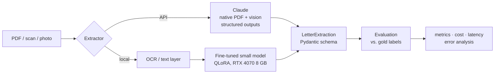

# bescheid

[](https://github.com/JulianRudrich/bescheid/actions/workflows/ci.yml)


**Turning German administrative letters into structured, actionable data, and measuring how well frontier LLMs and a fine-tuned small model do it.**

German authorities communicate through *Bescheide*: tax assessments, fee notices, fines, reminders, benefit decisions. They are written in dense *Amtsdeutsch*, and missing a payment date or an objection period has real consequences. `bescheid` extracts what the recipient needs to know (who sent it, what it is, what to pay, by when, and how to object) into a validated schema.

The project is built **evaluation-first**: a hand-labeled dataset of real letters is the basis for every decision, from prompt design to the question of whether a 3B-parameter model fine-tuned on a laptop GPU can replace a frontier API.

> **Status:** 🚧 Week 1 of 5, building the labeled dataset. See the [roadmap](#roadmap).

## Results

_Measured on the held-out test set once the dataset is complete._

| Model | Document exact ↑ | Payments F1 ↑ | Deadlines F1 ↑ | Cost / 1k letters ↓ | p95 latency ↓ |
|---|---|---|---|---|---|
| Claude Opus 5.5 | – | – | – | – | – |
| Claude Sonnet 5.5 | – | – | – | – | – |
| Claude Haiku 4.5 | – | – | – | – | – |
| Fine-tuned small open model (local) | – | – | – | – | – |

Metric definitions: [docs/evaluation.md](docs/evaluation.md).

## Example

Input: [a synthetic payment reminder](data/samples/synthetic_mahnung_001.pdf) (PDF).

```bash
uv run bescheid extract data/samples/synthetic_mahnung_001.pdf
```

Expected output, i.e. the hand-written [gold label](data/samples/synthetic_mahnung_001.json):

```json
{
  "letter_type": "payment_reminder",
  "issuing_authority": "Stadt Musterstadt, Stadtkasse",
  "letter_date": "2026-09-14",
  "reference_number": "5.0412.778.3",
  "action_required": true,
  "payments": [
    {"amount_eur": 101.5, "due_date": "2026-09-28",
     "iban": "DE02120300000000202051", "payment_reference": "5.0412.778.3"}
  ],
  "deadlines": [
    {"kind": "payment", "due_date": "2026-09-28",
     "description": "Gesamtbetrag von 101,50 EUR überweisen"}
  ],
  "legal_remedy": null,
  "summary": "Die Stadt mahnt die unbezahlte Hundesteuer für das 3. Quartal 2026 an. ..."
}
```

Note the traps in this letter: the item amount (96,50 €) is not what has to be paid, and a reminder has no objection period.

## How it works



- **One schema, one contract.** [`LetterExtraction`](src/bescheid/schema.py) is used for labels, model outputs and scoring. Model outputs are constrained to it with structured outputs, so there is no JSON parsing that can fail.
- **Interchangeable extractors.** Every backend implements the same [`Extractor`](src/bescheid/extractors/base.py) protocol, so API models and local models are compared on identical terms.
- **Versioned prompts.** Prompts live in [`src/bescheid/prompts/`](src/bescheid/prompts/) and are never edited in place; every result names the prompt version it used.
- **Reproducible runs.** Each run stores predictions, configuration, git commit, cost and latency. Scoring is a separate, free step.

## Quickstart

Requires [uv](https://docs.astral.sh/uv/) and an [Anthropic API key](https://console.anthropic.com/).

```bash
git clone https://github.com/JulianRudrich/bescheid.git
cd bescheid
uv sync
cp .env.example .env        # add your ANTHROPIC_API_KEY

uv run bescheid extract data/samples/synthetic_mahnung_001.pdf
uv run pytest
```

Evaluating on your own labeled letters:

```bash
uv run bescheid validate-labels
uv run bescheid run --split dev --model claude-opus-5-5
uv run bescheid score results/<run_id>
```

## Project structure

```
src/bescheid/
├── schema.py            # extraction target (the contract)
├── documents.py         # PDF / image loading
├── dataset.py           # labels and splits
├── extractors/          # Claude API, local model (week 4)
├── prompts/             # versioned system prompts
├── evaluation/          # run, score, metrics
└── cli.py               # `bescheid` command
data/                    # see data/README.md, private data is gitignored
docs/                    # labeling guide, evaluation, decision records
tests/
```

## Roadmap

- [ ] **Week 1: Dataset.** Collect ~150 letters, define schema, label 100 ([labeling guide](docs/labeling-guide.md))
- [ ] **Week 2: Evaluation.** Implement metrics, first baseline with Claude Opus 5.5
- [ ] **Week 3: Model comparison.** Opus vs. Sonnet vs. Haiku, prompt iterations, error analysis
- [ ] **Week 4: Fine-tuning.** QLoRA on a small open model on a local RTX 4070 (8 GB); synthetic training data
- [ ] **Week 5: Ship it.** FastAPI service, web demo, Docker, write-up

## Design decisions

Recorded in [docs/decisions/](docs/decisions/):

1. [Build the evaluation before the system](docs/decisions/0001-evaluation-first.md)
2. [Private documents never enter the repository](docs/decisions/0002-private-data-stays-local.md)

## Limitations

_Filled in with the error analysis in week 3._

## License

[MIT](LICENSE)
